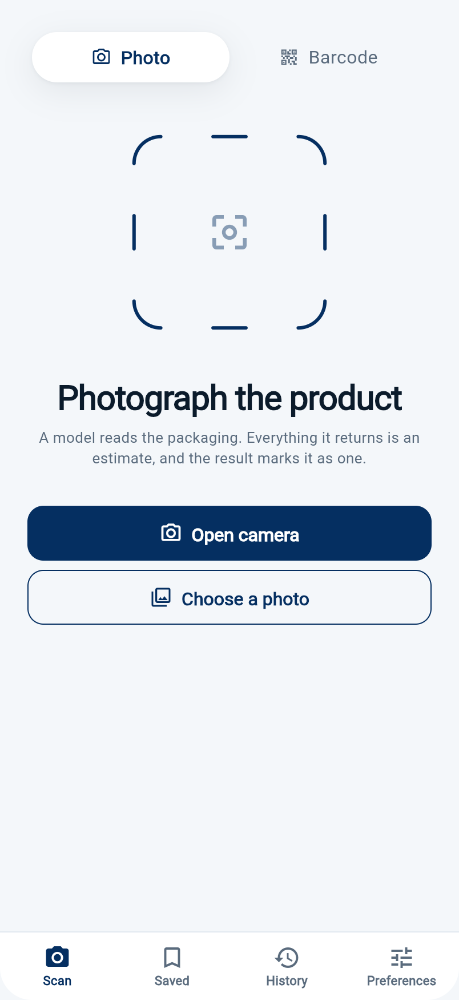
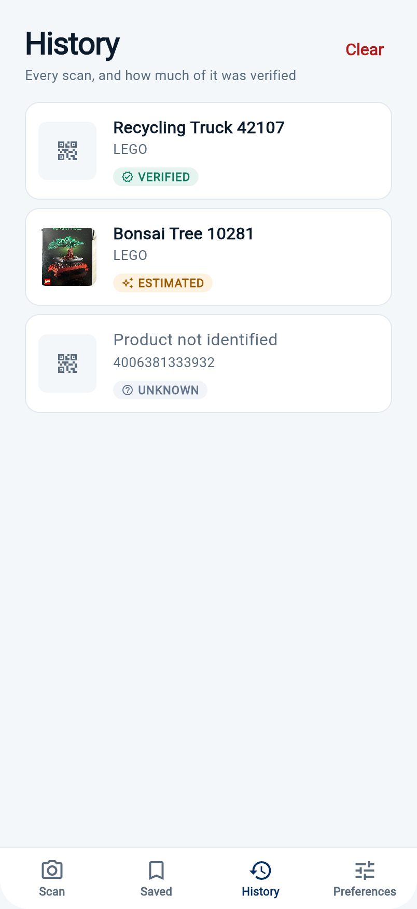
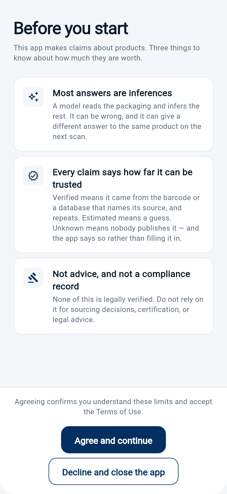

# Recognition Camera

A Flutter app that tells you what a product is — and how much of that it can actually back up.

Three sources, and the app never confuses them. A **barcode** decodes offline to a GS1
member country, check digit first, and that answer repeats. A **photograph** goes to a vision
model, which guesses. A **YOLOv8 model on the phone** checks the frame before anything is
uploaded, so a badly-framed shot is caught while the user can still retake it. Every claim
on screen carries which of these it came from.

Built as a portfolio piece to show what an AI feature looks like when it is engineered rather
than demoed: hand-written tensor post-processing, a provenance model that cannot be bypassed,
an accuracy figure that was **measured and published rather than asserted**, and a consent
gate before the first frame is captured.

> **One codebase, both platforms.** Everything here builds for iOS and Android from the same
> Dart source.

**▶ [Try it in your browser](https://derenchukvip-pixel.github.io/recognition-camera/)**
— seven screens, switchable, running against fixtures. Deep links:
[`?screen=history`](https://derenchukvip-pixel.github.io/recognition-camera/?screen=history) ·
[`?screen=unreadable`](https://derenchukvip-pixel.github.io/recognition-camera/?screen=unreadable) ·
[`?screen=consent`](https://derenchukvip-pixel.github.io/recognition-camera/?screen=consent)

The full app cannot run on the web — `tflite_flutter`, `camera` and `mobile_scanner` are
platform plugins with no web implementation, and the records live in Hive. The screens can,
because each takes plain data and callbacks and reaches for nothing else. That separation is
not a trick for the demo: it is what lets the design be reviewed without a device, and every
screenshot below is captured headlessly from that same build.

## Screenshots

| Scan | Barcode result — verified | Photo result — estimated |
|---|---|---|
|  |  |  |

| Unreadable barcode | History | Consent gate |
|---|---|---|
|  |  |  |

**Scan** states what each mode's answer is worth before the scan rather than after it: a
photo yields an estimate, a barcode yields a lookup that repeats.

**Verified** — the country comes from the barcode, so it is attributed to the GS1 prefix it
was read from, with the caveat that this is where the brand *registered*, not where the
goods were made.

**Estimated** — recognition from a photo only. The headquarters claim is Estimated rather
than Verified because it is derived from a brand that was itself only recognised from an
image; a claim never outranks the claim it rests on.

**Unreadable** — the barcode fails its check digit, so nothing earns a Verified badge. An
earlier build reported a confident, wrong country here.

**History** — the badge is in the list, not only on the detail screen. A reproducible
barcode reading and a model's guess are distinguishable without opening either row.

## Contents

- [What it does](#what-it-does)
- [Measured accuracy](#measured-accuracy)
- [Architecture](#architecture)
- [Why it's built this way](#why-its-built-this-way)
- [The inference pipeline](#the-inference-pipeline)
- [Tech stack](#tech-stack)
- [Running it](#running-it)
- [Tests](#tests)
- [Design decisions worth flagging](#design-decisions-worth-flagging)

## What it does

| Capability | How |
|---|---|
| Frame check, offline | YOLOv8n via TensorFlow Lite, bundled as an asset. Says whether the photo holds a recognisable object *before* it is uploaded |
| Barcode scanning | `mobile_scanner`, feeding a GS1 prefix decode and an Open Food Facts lookup |
| Product information | Open Food Facts REST API, TTL-cached |
| Measured accuracy | An eval harness over 50 openly-licensed products — see [Measured accuracy](#measured-accuracy) |
| Cloud recognition (optional) | Multipart upload to a FastAPI backend, behind an interface |
| History & saved items | Hive, survives restarts |
| Origin preferences | User-set preferences persisted locally |
| First-run consent | Explicit disclaimer acceptance before the camera opens |

Seven screens: splash, consent gate, scan (photo or barcode), camera capture, barcode
scanner, result, and three tabs — history, saved, preferences.

## Measured accuracy

Everyone building on a vision model writes "AI-powered". Here is how often this one is
wrong, and the code that produced the number.

Fifty products from Open Food Facts, run end to end through the deployed backend and scored
against the reference labels. Latest run, `gpt-5.6-terra`, 2026-08-10:

| Outcome | Product name | Brand |
|---|---|---|
| Correct | 29 (58%) | 37 (74%) |
| **Wrong, stated as an answer** | 6 (12%) | 6 (12%) |
| Partly right — not scored either way | 11 (22%) | 0 |
| Abstained — "Not identified" | 4 (8%) | 7 (14%) |

```bash
python3 eval/run_eval.py     # standard library only, nothing to install
```

**Not one of those confident errors reaches a user as a fact.** Everything the photo path
produces is rendered `ESTIMATED`, and a test fails if a claim on that path is ever marked
`VERIFIED`. That is the provenance model expressed as a number instead of as a principle.

Two things about the harness are worth more than the figures. It reports **four outcomes,
not two** — a matcher forced to call every answer right or wrong pushes marginal cases into
whichever bucket its author preferred, so the eleven partly-right rows are counted as
neither. And **abstention is not an error**: a system that is right 58% of the time and
silent otherwise is worth more than one right 70% of the time that invents the rest.
Removing the backend prompt's instruction to "never leave any section empty" moved confident
errors from 16% to 12%, and the errors that disappeared became silence rather than correct
answers.

The first version of the brand metric reported 30% errors and was thrown away before
publication: thirteen of the fifteen were the model naming the parent company correctly
while the reference held the on-pack brand. The audit, the rows, and what this dataset is
and is not are in **[eval/README.md](eval/README.md)**.

## Architecture

```
              presentation/                    ← screens + ChangeNotifier view models
     detection · camera · barcode · report
     history · saved · preferences · terms
                     |
                     v
                domain/                        ← ProductReport, ProvenanceClaim, Detection
       every claim carries where it came from
                     |
        +------------+-------------+
        |                          |
        v                          v
   data/ai/                    data/recognition/
   ObjectDetector (interface)  RecognitionApi  (interface)
        |                          |
        v                          v
   OnDeviceAIService           RecognitionApiDio  (Dio + multipart)
   - TFLite interpreter             |
   - YOLOv8n, 640x640               v
        |                     core/error/AppError
        v                     mapToUserMessage(...)
   yolo_postprocess.dart            |
   - decode [1,84,8400]             v
   - NMS over IoU              user-facing message
   - no interpreter, so        (never a raw DioException)
     it is unit-testable
        |
        v
   "bottle in frame" — a category, never a product

   core/cache/SimpleCache<T>   ← generic TTL cache, used for product lookups
   core/cache/HistoryStorage   ← Hive-backed, survives restarts
   core/consent/DisclaimerStorage
```

`RecognitionApi` is an interface with `RecognitionApiDio` as the only production
implementation. That is what makes the view model testable without a server — see
[Tests](#tests).

## Why it's built this way

**The on-device model is used for what it can actually do.** YOLOv8n detects the 80 COCO
categories. It can say there is a bottle in the frame; it can never say *which* bottle,
because COCO has no notion of a brand. An earlier version of this README claimed the app
"identifies what the camera is pointed at entirely on the device", which was wrong twice
over — the identification is a cloud call, and the on-device code had drifted out of the
navigation entirely and was reachable from no screen at all.

So it does the job it is good at. Before a photo is uploaded, the model runs locally and
reports whether the frame holds a recognisable object. That catches a blurred or badly-aimed
shot at the moment the user can still retake it, costs no network, and sends nothing
anywhere. The screen showing it says in as many words that a category is not a product — a
detector that answers "bottle" next to a Verified badge would be laundering an object class
into an identification.

It is an aid, not a gate: a detector that fails to load leaves the screen silent rather than
blocking the scan or blaming the user's framing for a model that never started.

**The post-processing is written out, not imported.** A TFLite interpreter hands back a raw
`[1, 84, 8400]` tensor — 8400 candidate boxes, each with 80 class scores and 4 geometry values.
Turning that into "there is a laptop here" is the actual work: transposing the layout, filtering
by confidence, converting `[cx, cy, w, h]` to corner coordinates, rescaling from the 640×640
letterbox back to source-image pixels, then running **Non-Maximum Suppression** over an
**IoU** computation to collapse the dozen overlapping boxes the model emits for one object.
All of that is in `data/ai/yolo_postprocess.dart` as readable Dart rather than hidden behind
a helper package, because when the model is swapped this is the code that has to change.

It sits apart from the interpreter so it can be tested without a 6 MB model file and a native
delegate — and pulling it out immediately paid for itself. The IoU function read `[x, y, w, h]`
as if `x, y` were the box centre and subtracted half the width again, but the decode step had
already converted centre to corner. Two boxes were each shifted by half of *their own* size
before being compared, so the overlap of two differently-sized boxes was measured between
rectangles neither of them occupied. Equal-size boxes cancelled the error exactly, which is
why it survived: the duplicates NMS usually sees are near-identical. There is now a test for
a small box inside a large one, which is the case that fails.

**Every failure has a sentence a user can act on.** `mapToUserMessage` in `core/error/app_error.dart`
covers each `DioExceptionType` explicitly — timeout, connection error, bad certificate, 4xx,
5xx — plus `SocketException` and `FormatException`. A timeout says the request timed out; a
500 says the server is having trouble; a parse failure says the data was malformed. The
alternative is one "something went wrong" for everything, which tells the user nothing and
tells whoever is debugging it even less.

**Consent is a gate, not a checkbox.** `DisclaimerStorage` records first-run acceptance and the
camera screen is unreachable until it is granted. For an app whose entire purpose is pointing a
camera at things, that ordering is the difference between a defensible privacy posture and a
liability.

## The inference pipeline

```
 File (JPEG from camera or gallery)
   |
   v  image.decodeImage
 Image
   |
   v  copyResize -> 640 x 640
 resized
   |
   v  per-pixel normalise to 0..1, BGR order, Float32List
 input [1, 640, 640, 3]
   |
   v  Interpreter.run
 output [1, 84, 8400]        84 = 80 COCO classes + 4 box values
   |
   v  argmax over classes, keep confidence > 0.50
 candidate detections
   |
   v  [cx, cy, w, h] -> [x, y, w, h], rescale to source dimensions
 detections in image pixels
   |
   v  NMS, IoU threshold 0.45, per class
 deduplicated detections
   |
   v  best per label, sort by confidence, take 3
 "Detected: laptop (confidence: 91.4%) at [x: …, y: …, w: …, h: …]"
```

Thresholds (`0.50` confidence, `0.45` IoU) are the tuned values for this model; both are
single constants in `OnDeviceAIService`.

## The optional backend

`server/` holds the cloud-recognition service the app talks to when a heavier model is
worth the round trip: **FastAPI, ~500 lines**, deployed on Railway.

It is not a thin proxy. Most of it is the work of turning a vision model's prose into
fields worth showing — rejecting answers where the model returned a generic category word
instead of a brand, or echoed the product name back as the manufacturer, or replied with
an apology. That filtering lives in `server/answers.py` with 25 tests, none of which need
an API key. The app's on-device path stays fully functional when this service is
unreachable, which is the whole reason it sits behind the `RecognitionApi` interface.

**The prompt is the part that mattered most.** An earlier version required percentages
("Always include percentages") and forbade silence ("Never leave any section empty"), which
is how the same LEGO box produced "Czech Republic 70%, Hungary 30%" on one scan and
different figures on the next. It now asks for country names or nothing, and tells the model
that "Not identified" is a valid answer for any field. The eval above is what that change
is worth.

`OPENAI_MODEL` selects the model and both `/analyze/` and `/health` report it, so an eval run
records what produced its numbers. The `OPENAI_API_KEY` is read from the environment; nothing
secret is in the repository.

## Tech stack

**Mobile** Flutter 3 / Dart 3 · `tflite_flutter` (YOLOv8n + MobileNet v1 assets) ·
`camera` · `mobile_scanner` · `image` for pre-processing · `dio` · `provider` · `hive` ·
`shared_preferences` · `flutter_localizations`

**Backend** Python · FastAPI · OpenAI Responses API · Redis (exact and perceptual-hash
caching) · Railway

**Evaluation** Python standard library only — no dependency to install before reproducing
the accuracy figures

## Running it

```bash
flutter pub get
flutter run
```

The on-device path needs no configuration — the model ships in `assets/models/`.

To point the optional cloud recognition at your own backend:

```bash
flutter run --dart-define=RECOGNITION_BASE_URL=https://your-server
```

Without it, the app falls back to the default configured in `core/config/app_config.dart`.
If that endpoint is unreachable, the on-device path still works — that is the whole point of
the split.

Build artefacts:

```bash
flutter build apk --release          # Android
flutter build ios --release          # iOS
```

## Tests

```bash
flutter analyze                          # No issues found!
flutter test                             # 92 tests
python3 -m unittest discover -s server   # 25 tests
python3 -m unittest discover -s eval     # 17 tests
```

Verified on Flutter 3.44.9 / Dart 3.12.2.

| File | What it covers |
|---|---|
| `report_from_recognition_test.dart` | The live photo path. Invented percentages are stripped, nothing from a photo is ever Verified, and a percentage that belongs to the product name survives |
| `report_from_barcode_test.dart` | The barcode path. A failed check digit earns no Verified badge anywhere; a barcode absent from Open Food Facts still produces a report from the prefix alone |
| `report_from_history_test.dart` | Recovering stored records, including rows written before provenance was kept |
| `scan_result_screen_test.dart` | The result screen, fed the exact backend response, asserted on what a user reads |
| `scan_list_card_test.dart` | A list row shows how much of it was verified before it is opened |
| `scan_home_view_test.dart` | The scan-mode switch, and that the visible action is the one that runs |
| `yolo_postprocess_test.dart` | The tensor decode, NMS and IoU, including the box-inside-a-box case that exposed a real bug |
| `frame_check_test.dart` | The offline frame check: what it reports, that a stale result cannot overwrite a newer photo, and that a broken detector stays silent |
| `gs1_prefixes_test.dart` | Prefix table, check digits, special-use ranges |
| `saved_products_storage_test.dart` | Persistence round-trip, including that badges survive it |
| `recognition_result_test.dart` | Parsing the backend envelope |
| `detection_view_model_test.dart` | Analysis flow against a `FakeRecognitionApi`, so no server is involved |
| `widget_test.dart` | Boot, and that the consent gate still states its three limits |

The widget tests exist because the unit tests were not enough once already. The provenance
model, its adapters and its badges were all covered, and the live scan bypassed every one of
them — an adapter test proves the mapping is right, not that anything calls it.

### Context safety

The camera and barcode flows both `await` between resolving a `BuildContext` and using it —
inference takes seconds, and the user can leave the screen in the meantime. Every such site
resolves `Navigator` / `ScaffoldMessenger` **before** the gap and re-checks `mounted` after it,
so a user who backs out mid-analysis gets nothing instead of a crash. `flutter analyze` reports
zero `use_build_context_synchronously` findings, which is the check that catches regressions
here.

## Design decisions worth flagging

- **Two models are bundled** — MobileNet v1 (classification) and YOLOv8n (detection). YOLOv8n
  is the one wired into the current detection path; MobileNet remains for the lighter
  classification-only route.
- **`SimpleCache<T>` is deliberately in-memory.** Product lookups are cached with a TTL for the
  session; they are not persisted, because Open Food Facts records change and a stale nutrition
  panel is worse than a second request. Persistence is reserved for history and saved items,
  which are the user's own data.
- **View models are `ChangeNotifier` + `provider`, not BLoC.** The state here is small and
  screen-local. BLoC would add ceremony without adding clarity at this size — the tradeoff would
  flip if these screens needed to share state.
- **BGR channel order in the input tensor** is intentional and matches how the bundled model
  was exported. It is the kind of detail that silently destroys accuracy if it is guessed.
- **No auth.** The app has no accounts by design; everything a user creates is local to the
  device.

---

Built by [Artsiom D.](https://github.com/derenchukvip-pixel) · Flutter · iOS + Android
