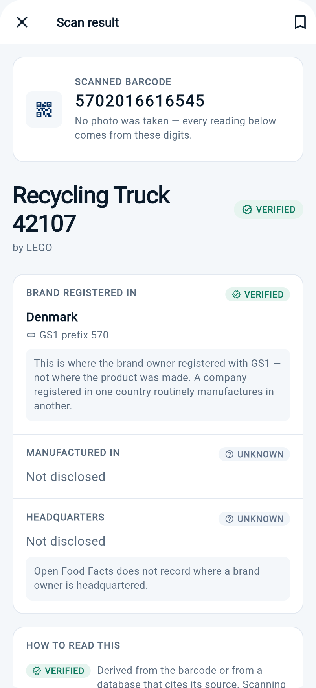
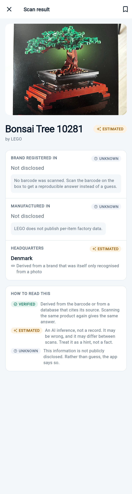
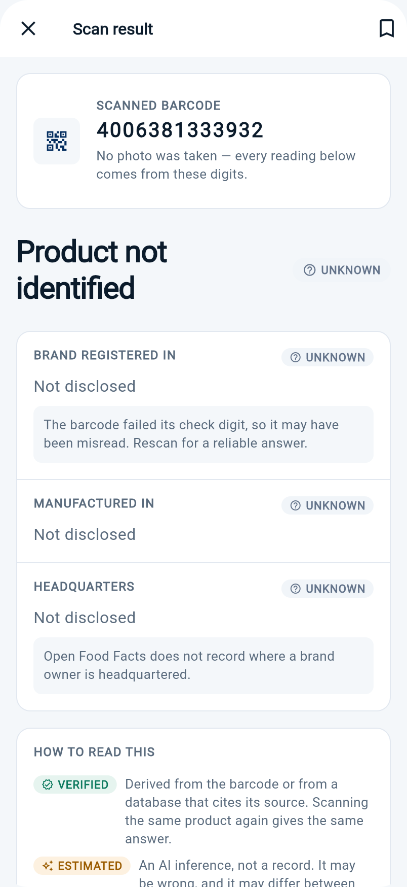

# Recognition Camera

A Flutter app that identifies what the camera is pointed at — **entirely on the device**.
Point it at an object and a YOLOv8 model running locally returns labelled bounding boxes;
scan a barcode and it pulls the product record from Open Food Facts. No image ever leaves the
phone for the on-device path, and the app stays useful with the network switched off.

Built as a portfolio piece to show what an AI feature looks like when it is engineered rather
than demoed: a real inference pipeline with hand-written post-processing, a typed error
taxonomy, TTL caching, and an explicit consent gate before the first frame is captured.

> **One codebase, both platforms.** Everything here builds for iOS and Android from the same
> Dart source.

**▶ [Try the result screen in your browser](https://derenchukvip-pixel.github.io/recognition-camera/)**
— three states, switchable: a verified barcode scan, a photo-only scan, and a barcode that
fails its check digit. Deep links: [`?fixture=unreadable`](https://derenchukvip-pixel.github.io/recognition-camera/?fixture=unreadable)

The full app cannot run on the web — `tflite_flutter`, `camera` and `mobile_scanner` are
platform plugins with no web implementation. The result screen can, because it takes a
plain `ProductReport` and nothing else.

## Screenshots

| Barcode scan — verified | Photo scan — estimated | Unreadable barcode |
|---|---|---|
|  |  |  |

Left: the country comes from the barcode, so it is marked Verified and attributed to the
GS1 prefix it was read from — with the caveat that this is where the brand *registered*,
not where the goods were made.

Middle: recognition from a photo only. The headquarters claim is Estimated rather than
Verified because it is derived from a brand that was itself only recognised from an image —
a claim never outranks the claim it rests on.

Right: the barcode fails its check digit, so nothing earns a Verified badge. An earlier
build would have reported a confident, wrong country here.

## Contents

- [What it does](#what-it-does)
- [Architecture](#architecture)
- [Why it's built this way](#why-its-built-this-way)
- [The inference pipeline](#the-inference-pipeline)
- [Tech stack](#tech-stack)
- [Running it](#running-it)
- [Tests](#tests)
- [Design decisions worth flagging](#design-decisions-worth-flagging)

## What it does

| Capability | How |
|---|---|
| Object recognition, offline | YOLOv8n via TensorFlow Lite, bundled as an asset |
| Barcode scanning | `mobile_scanner`, feeding the Open Food Facts lookup |
| Product information | Open Food Facts REST API, TTL-cached |
| Cloud recognition (optional) | Multipart upload to a FastAPI backend, behind an interface |
| History & saved items | Hive, survives restarts |
| Origin preferences | User-set preferences persisted locally |
| First-run consent | Explicit disclaimer acceptance before the camera opens |

Ten screens: splash, terms, camera capture, live detection, barcode scanner, product info,
analysis detail, history, saved, preferences.

## Architecture

```
              presentation/                    ← screens + ChangeNotifier view models
     camera · detection · barcode · product
     history · saved · preferences · terms
                     |
                     v
                domain/models/                 ← RecognitionResult, HistoryItem, SavedProduct
                     |
        +------------+-------------+
        |                          |
        v                          v
   data/ai/                    data/recognition/
   OnDeviceAIService           RecognitionApi  (interface)
   - TFLite interpreter             |
   - YOLOv8n, 640x640               v
   - hand-written NMS + IoU    RecognitionApiDio  (Dio + multipart)
        |                          |
        |                          v
        |                     core/error/AppError
        |                     mapToUserMessage(...)
        v                          |
   runs fully offline              v
                            user-facing message
                            (never a raw DioException)

   core/cache/SimpleCache<T>   ← generic TTL cache, used for product lookups
   core/cache/HistoryStorage   ← Hive-backed, survives restarts
   core/consent/DisclaimerStorage
```

`RecognitionApi` is an interface with `RecognitionApiDio` as the only production
implementation. That is what makes the view model testable without a server — see
[Tests](#tests).

## Why it's built this way

**On-device first, cloud as an option — not the other way round.** The obvious way to build
this is to POST every frame to a server and let a GPU do the work. That gives you a demo, and
a product that is useless in a supermarket basement, costs money per photo, and ships every
user's camera roll to a third party. Here the YOLOv8n model is bundled as an asset and runs
through `tflite_flutter` locally; `RecognitionApiDio` exists for the cases where a heavier
cloud model is genuinely worth it, but it sits behind the `RecognitionApi` interface so the
offline path is never load-bearing on a network call.

**The post-processing is written out, not imported.** A TFLite interpreter hands back a raw
`[1, 84, 8400]` tensor — 8400 candidate boxes, each with 80 class scores and 4 geometry values.
Turning that into "there is a laptop here" is the actual work: transposing the layout, filtering
by confidence, converting `[cx, cy, w, h]` to corner coordinates, rescaling from the 640×640
letterbox back to source-image pixels, then running **Non-Maximum Suppression** over an
**IoU** computation to collapse the dozen overlapping boxes the model emits for one object.
All of that is in `OnDeviceAIService` as readable Dart rather than hidden behind a helper
package, because when the model is swapped this is the code that has to change.

**Every failure has a sentence a user can act on.** `mapToUserMessage` in `core/error/app_error.dart`
covers each `DioExceptionType` explicitly — timeout, connection error, bad certificate, 4xx,
5xx — plus `SocketException` and `FormatException`. A timeout says the request timed out; a
500 says the server is having trouble; a parse failure says the data was malformed. The
alternative is one "something went wrong" for everything, which tells the user nothing and
tells whoever is debugging it even less.

**Consent is a gate, not a checkbox.** `DisclaimerStorage` records first-run acceptance and the
camera screen is unreachable until it is granted. For an app whose entire purpose is pointing a
camera at things, that ordering is the difference between a defensible privacy posture and a
liability.

## The inference pipeline

```
 File (JPEG from camera or gallery)
   |
   v  image.decodeImage
 Image
   |
   v  copyResize -> 640 x 640
 resized
   |
   v  per-pixel normalise to 0..1, BGR order, Float32List
 input [1, 640, 640, 3]
   |
   v  Interpreter.run
 output [1, 84, 8400]        84 = 80 COCO classes + 4 box values
   |
   v  argmax over classes, keep confidence > 0.50
 candidate detections
   |
   v  [cx, cy, w, h] -> [x, y, w, h], rescale to source dimensions
 detections in image pixels
   |
   v  NMS, IoU threshold 0.45, per class
 deduplicated detections
   |
   v  best per label, sort by confidence, take 3
 "Detected: laptop (confidence: 91.4%) at [x: …, y: …, w: …, h: …]"
```

Thresholds (`0.50` confidence, `0.45` IoU) are the tuned values for this model; both are
single constants in `OnDeviceAIService`.

## The optional backend

`server/` holds the cloud-recognition service the app talks to when a heavier model is
worth the round trip: **FastAPI, ~500 lines**, deployed on Railway.

It is not a thin proxy. Most of it is the work of turning a vision model's prose into
fields worth showing — rejecting answers where the model returned a generic category word
instead of a brand, or echoed the product name back as the manufacturer, or replied with
an apology. The app's on-device path stays fully functional when this service is
unreachable, which is the whole reason it sits behind the `RecognitionApi` interface.

The `OPENAI_API_KEY` is read from the environment; nothing secret is in the repository.

## Tech stack

**Mobile** Flutter 3 / Dart 3 · `tflite_flutter` (YOLOv8n + MobileNet v1 assets) ·
`camera` · `mobile_scanner` · `image` for pre-processing · `dio` · `provider` · `hive` ·
`shared_preferences` · `flutter_localizations`

**Backend** Python · FastAPI · OpenAI vision · Docker · Railway

## Running it

```bash
flutter pub get
flutter run
```

The on-device path needs no configuration — the model ships in `assets/models/`.

To point the optional cloud recognition at your own backend:

```bash
flutter run --dart-define=RECOGNITION_BASE_URL=https://your-server
```

Without it, the app falls back to the default configured in `core/config/app_config.dart`.
If that endpoint is unreachable, the on-device path still works — that is the whole point of
the split.

Build artefacts:

```bash
flutter build apk --release          # Android
flutter build ios --release          # iOS
```

## Tests

```bash
flutter analyze   # No issues found!
flutter test      # 8 tests, all passing
```

Verified on Flutter 3.44.9 / Dart 3.12.2.

| File | What it covers |
|---|---|
| `detection_view_model_test.dart` | Analysis flow drives status → success, populates result and timing, leaves `errorMessage` null. Uses a `FakeRecognitionApi`, so no server is involved |
| `recognition_result_test.dart` | Parsing of the backend response envelope, including the raw-string and JSON-map shapes |
| `saved_products_storage_test.dart` | Persistence round-trip for saved products |
| `widget_test.dart` | App boots and renders |

`RecognitionApi` being an interface is what makes the first of these possible: the view model
is exercised against a fake, so the test is fast and deterministic.

### Context safety

The camera and barcode flows both `await` between resolving a `BuildContext` and using it —
inference takes seconds, and the user can leave the screen in the meantime. Every such site
resolves `Navigator` / `ScaffoldMessenger` **before** the gap and re-checks `mounted` after it,
so a user who backs out mid-analysis gets nothing instead of a crash. `flutter analyze` reports
zero `use_build_context_synchronously` findings, which is the check that catches regressions
here.

## Design decisions worth flagging

- **Two models are bundled** — MobileNet v1 (classification) and YOLOv8n (detection). YOLOv8n
  is the one wired into the current detection path; MobileNet remains for the lighter
  classification-only route.
- **`SimpleCache<T>` is deliberately in-memory.** Product lookups are cached with a TTL for the
  session; they are not persisted, because Open Food Facts records change and a stale nutrition
  panel is worse than a second request. Persistence is reserved for history and saved items,
  which are the user's own data.
- **View models are `ChangeNotifier` + `provider`, not BLoC.** The state here is small and
  screen-local. BLoC would add ceremony without adding clarity at this size — the tradeoff would
  flip if these screens needed to share state.
- **BGR channel order in the input tensor** is intentional and matches how the bundled model
  was exported. It is the kind of detail that silently destroys accuracy if it is guessed.
- **No auth.** The app has no accounts by design; everything a user creates is local to the
  device.

---

Built by [Artsiom D.](https://github.com/derenchukvip-pixel) · Flutter · iOS + Android
